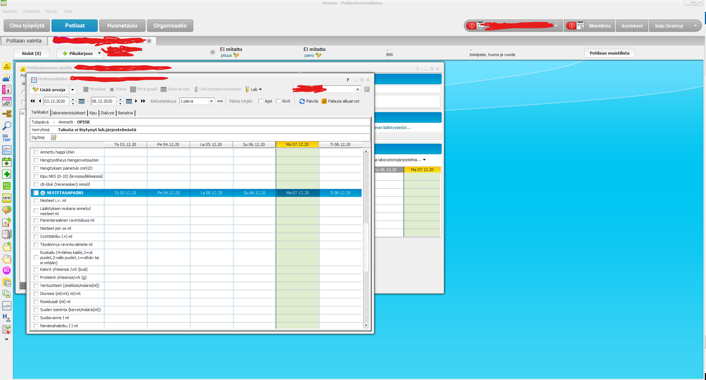

# Improve Apotti

Final project for the Building AI course

## Summary

The aim of this project is to make Apotti system easier to use. A major problem with the system is a lack of logic and proper user interface.
It also limits users' choices in a way that makes its use more complicated.

## Background

* It's way too complex to make orders in Apotti. It's much quicker just to write down your orders as a free text and let the AI generate structured commands from the free text.
* It is diffucult to get your daily needed information out of Apotti, because everything is scattered in separate small boxes without uniform design.
* All possible commands and screens should be available all the time and not only when the patient is in certain mode.

## How is it used?

This program is an add-on for Apotti system that overrides restrictions within the system and creates a new user friendly interface

## Data sources and AI methods
This program will need to be controlled by an experienced coder. The AI will need to be able to recode free text into structural form.

| Syntax      | Description |
| ----------- | ----------- |
| Data_source | Users       |
| 2nd_source  | Developers  |

## Challenges

Project Apotti has already wasted 800 000 000 euros without accomplishin this, so it must be really diffult...

## What next?

I would happily become an end user once the project is functioning. Further development will of course be needed.

## Acknowledgments

* Apotti. CGI. Uranus. Miranda. Effica. Pegasos. GFS. Lauri Ahonen.
